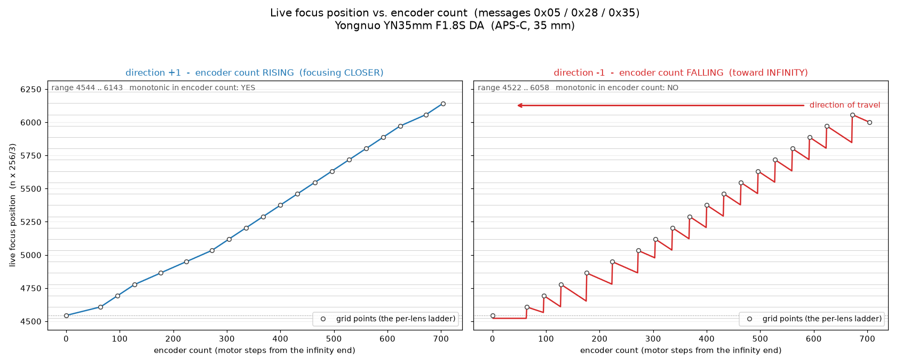
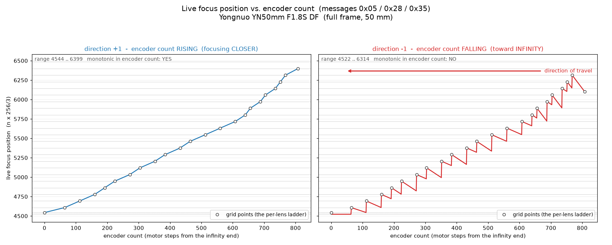
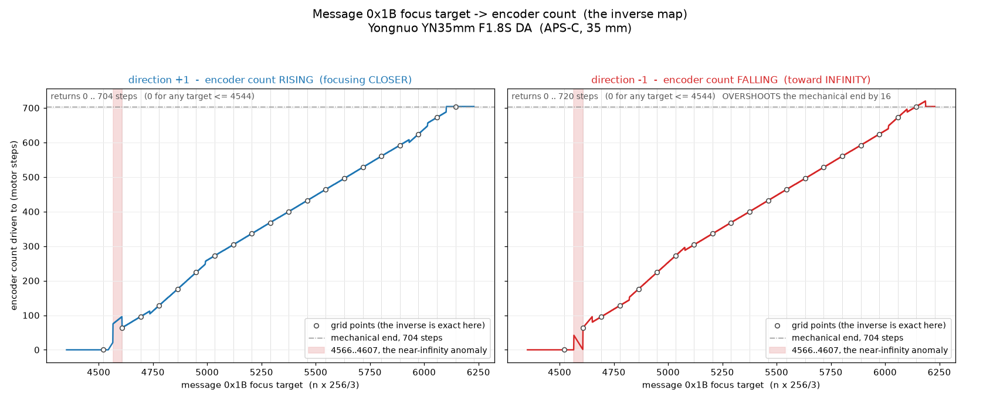
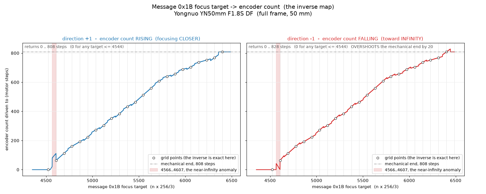

# The live focus position

The **live focus position** is the lens's current focus setting expressed on a single scale shared
by every device on the bus:

> **`position = n × 256 / 3`**, for a distance index `n`.

One grid point is `256/3` = 85.333…, so the field advances in thirds of 256 — which is what
"the protocol quantises in thirds of 256" means. The value is transmitted as a **u16 little-endian**
integer.

It is **not** the lens's own encoder count. That distinction is the subject of
[section 2](#2-it-is-not-an-encoder-count), and getting it wrong is the single most common way to
produce a lens or adapter that reports a plausible-looking number the body cannot use.

---

# 1. Where it appears

The same quantity, in the same units, travels in four messages — three carrying it as a **report**
from the lens, one carrying it as a **command** from the body.

| Message | Direction | Field | Role |
| --- | --- | --- | --- |
| **[0x05](msg_0x05.md)** | L→B | `pl[0..1]`, and a second identical copy at `pl[2..3]` | The live report, once per 60 Hz frame |
| **[0x28](msg_0x28.md)** | L→B | `[0x0F..0x10]`, frame-relative | The same value, alongside the focal length and the correction rows |
| **[0x35](msg_0x35.md)** | L→B | `[0x0F..0x10]`, frame-relative | As above, on the request/response channel |
| **[0x1B](msg_0x1B.md)** | B→L | `pl[0..1]` — the **target**; the reply echoes the lens's current position at `pl[0..1]` and `pl[2..3]` | The command: "focus to this position" |

Two consequences worth stating plainly:

1. **The report path and the command path share one scale.** A body issues focus targets in exactly
   the units the lens reports position in. That is what makes the scale worth getting right.
2. **Messages 0x05, 0x28 and 0x35 must agree.** They are three views of the same live variable,
   built at the same instant from the same source. A device whose 0x05 position and 0x28 position
   disagree is inconsistent.

Message 0x05 duplicates the value into two adjacent fields. **They are not a "now / one frame ahead"
pair** — that split exists in [message 0x06](msg_0x06.md), not here; Yongnuo writes 0x05's two
fields identically in every state. The same is true of message 0x1B's reply: one position sent
twice, not a wide/tele pair.

---

# 2. It is not an encoder count

This is why [message 0x05](msg_0x05.md)'s position and [message 0x06](msg_0x06.md)'s position never
agree on any device.

**One physical variable, reported in two different spaces.** A lens tracks its focus mechanism with
a live **motor step counter** — the encoder count. Both status messages report that one counter,
transformed differently:

| Message | Field | Space | Value |
| --- | --- | --- | --- |
| **[0x06](msg_0x06.md)** | `pl[2..3]`, `pl[20..21]` | **Encoder counts** — device-specific | `base + steps`, a fixed per-vendor base (Yongnuo: `16080 + steps`) |
| **[0x05](msg_0x05.md)** / 0x28 / 0x35 / 0x1B | see [section 1](#1-where-it-appears) | **The protocol grid** — shared by every device | `n × 256/3`, via a per-lens ladder |

The two differ in kind, not just in offset:

| | Encoder count | Live focus position |
| --- | --- | --- |
| Meaning of one unit | One motor step of *this* mechanism | One third of a shared distance index |
| Comparable across devices | **No** | **Yes** |
| Origin | Wherever the lens homed | `4544`, a fixed infinity anchor |
| Range | Whatever the mechanism needs (Yongnuo 0…808; Sony SEL5518Z spans 5809) | `n ≈ 53…81` on every device measured; the tabulated grid runs `n` 51…75 = `4352…6400` |
| Monotonic in mechanical position | Yes | Ascending yes; descending, on at least one implementation, **no** — [section 3.3](#33-the-descending-branch-doubles-back) |
| Relationship to the other | — | Piecewise-linear through a per-lens ladder |

## 2.1 Landmarks on the grid

| `n` | Value | Significance |
| --- | --- | --- |
| 51 | 4352 | Bottom of the tabulated grid |
| **53.25** | **4544** | **The infinity anchor.** Reported verbatim at encoder count 0; a target at or below it commands infinity. The one landmark that is *not* an integer grid point |
| 57 | 4864 | Exactly the TECHART LM-EA9's fixed message 0x05 value |
| 66 | 5632 | Exactly the LM-EA9's upper travel clamp (message 0x06) |
| 72 | 6144 | Top of the 22-entry grid table every Yongnuo lens carries |
| 75 | 6400 | Top of the upward continuation the full-frame YN50 DF carries |

The 22-entry table `4352 … 6144` is **not per-lens data** — it is byte-identical across the Yongnuo
35 DA, 50 DA and 50 DF. It is simply `n × 256/3` tabulated.

Cross-check against observed ranges: every device measured falls in `n ≈ 53–81` — LM-EA9 4864;
Sony SELP1650 5053–5083; Sony SEL55210 5245–6911; Viltrox + Canon EF 50 4544–6336. A narrow band
across a 16–50 power zoom, a 55–210 tele and an EF adapter. **That is what a shared scale looks
like, and what device-specific encoder counts do not.**

## 2.2 The scale is absolute, not per-lens normalised

All three Yongnuo lenses report the identical **4544** at their infinity end, but they do *not* stop
at the same value: the full-frame 50 DF runs three grid points further than the two APS-C lenses.
A lens occupies whatever portion of the shared grid its travel needs.

| Lens | Ladder entries | Position at encoder count 0 | At full travel | Grid span reached |
| --- | --- | --- | --- | --- |
| Yongnuo YN35mm F1.8S DA | 19 | 4544 | 6143 | `n` 53.25 → 72 |
| Yongnuo YN50mm F1.8S DA | 19 | 4544 | 6143 | `n` 53.25 → 72 |
| Yongnuo YN50mm F1.8S DF | 22 | 4544 | 6399 | `n` 53.25 → 75 |

So `n = 51…72` is the *observed* span, not the scale's limit. `4352…6400` is the range attested so
far — and `6400 = 75 × 256/3` exactly, a useful check that the scale reading is right.

**Note 6143, not 6144, at the top of travel.** The forward map truncates the bucket base to 6058
from 6058.67 before adding its interpolation term, so it lands one count short of the tabulated
grid point. The exact 6144 is what the *inverse* accepts. Cosmetic — do not treat a 6143/6144
mismatch as a decode error.

## 2.3 The consequence for an adapter

Reporting a correct live value requires the device's own encoder→`n` ladder. **An adapter with no
electrical contact with the lens it carries cannot have one** without shipping a hardcoded per-lens
profile — and copying a raw encoder count across would put counts into a field that is not in
counts. See [section 6](#6-manufacturer-notes) for what the shipped adapters actually do.

---

# 3. Encoder count → live focus position (the report path)

## 3.1 The transform

A lens maps its own encoder counts onto the shared grid through a per-lens **ladder** of counts —
the count at which the mechanism crosses each grid point:

```
if steps == 0:  return 4544                        # 0x11C0 — the infinity anchor
if steps <  0:  return 4437                        # 0x1155
find k with P[k-1] <= steps < P[k]                 # per-lens ladder, 19–22 entries, P[0] = 0
base = (k + 52) * 256/3                            # integer-truncated
frac = (steps - P[k-1]) / (P[k-1+dir] - P[k-1])    # interpolate toward the travel direction
return base + frac * 85.33333333333333
```

Special cases: the first bucket uses `frac × 64 + 4544` rather than the 85.33 step, because that
segment spans 64 output counts; `dir == 0` (stationary) gives a zero interpolation width, so the
value snaps to the bucket base.

The map is piecewise-linear and collapses to one statement:

> **ladder point `k` ↦ `(k + 52) × 256/3`.**

`dir` is the **travel direction**, taken from the sign of the per-step increment: `+1` means the
encoder count is *rising*, which is the direction of higher reported positions — focusing closer.

## 3.2 The ladder is the only per-lens datum on this path

Same transform, different table:

| Lens | Encoder count at each grid point | Entries |
| --- | --- | --- |
| Yongnuo YN35 DA (35 mm APS-C) | 64 96 128 176 224 272 304 336 368 400 432 464 496 528 560 592 624 672 704 | 19 |
| Yongnuo YN50 DA (50 mm APS-C) | 112 160 224 272 304 336 400 432 480 512 560 592 624 656 688 704 736 768 784 | 19 |
| Yongnuo YN50 DF (50 mm FF) | 64 112 160 192 224 272 304 352 384 432 464 512 560 608 640 656 688 704 736 752 768 808 | 22 |

Feeding encoder count **400** through the three ladders gives **5376**, **5120** and **5318**. Same
mechanical count, three different reported positions — which is the whole point of the table.
Everything else on the path — the `× 256/3` grid, the 4544 anchor, message 0x06's fixed base — is
shared across the lineup.

### Worked example — Yongnuo YN35 DA, encoder count 416

416 falls in the bucket `P[10] = 400 … P[11] = 432`, so `k = 11` and `base = (11 + 52) × 256/3`
truncated = **5376** (grid point `n = 63`).

| Travel direction | Interpolation denominator | Reported position |
| --- | --- | --- |
| `+1` — closer | `P[11] − P[10]` = 32 | `5376 + (16/32) × 85.33` = **5418** |
| `0` — stationary | `P[10] − P[10]` = 0 → skipped | **5376** |
| `−1` — toward infinity | `P[9] − P[10]` = **−32** | `5376 + (16/−32) × 85.33` = **5333** |

One mechanical position, three reported values spanning a full grid point. That is not rounding
noise — see below.

## 3.3 The descending branch doubles back

`pl[0..1]` is a function of `(steps, direction)`, **not of `steps` alone**. The interpolation
denominator is indexed by `P[k-1+dir]`, and the three directions behave completely differently:

| `dir` | Denominator | Behaviour across bucket `k` |
| --- | --- | --- |
| `+1` | `P[k]`, the bucket's own upper bound — **positive** | Rises `base_k` → `base_k + 85.33`. Correct, and monotonic over the whole travel |
| `0` | `P[k-1]`, the bucket's own lower bound — **zero** | Interpolation skipped; snaps to `base_k` |
| `−1` | `P[k-2]`, the **previous** bucket's lower bound — **negative** | Falls `base_k` → `base_k − 85.33` as the count rises |

Replay an actual retreat toward infinity — the encoder count falling — and the reported position
**climbs** inside each bucket while the lens is physically moving the other way, then drops one to
two and a half grid points at every bucket boundary (86 to 212 counts on the YN35 DA). A sawtooth.

| Lens | Ladder entries | Discontinuities on a full retreat | Count transitions reported in the wrong direction |
| --- | --- | --- | --- |
| Yongnuo YN35 DA | 19 | **18** | **624 of 704** |
| Yongnuo YN50 DF | 22 | **21** | **725 of 808** |

The whole first bucket also reports a flat **4522** on both lenses, because at `k = 1, dir = −1`
the index clamps to `P[0]`, giving a zero interpolation width.

### The plots

**Yongnuo YN35mm F1.8S DA** — x is the encoder count, y is the reported live focus position, one
panel per direction of travel. Grey horizontal lines are the `n × 256/3` grid; circles are the
lens's ladder points.



**Yongnuo YN50mm F1.8S DF** — same map, 22-entry ladder, reaching grid point `n = 75`.



Left panel: clean, monotonic, and it lands exactly on a grid point at every ladder entry. Right
panel: the sawtooth. **The value repeatedly doubles back on itself while the lens focuses toward
infinity** — 18 discontinuities on the 35 DA, 21 on the 50 DF.

**This is very probably an implementation defect in the Yongnuo lenses, not a protocol feature.**
The reasons to read it that way:

- Nothing in the protocol asks for a direction-dependent position report. The body needs to know
  where focus *is*; a value that runs backwards during half of all travel cannot serve that.
- The `P[k-1+dir]` index looks like an off-by-one that was intended to select the segment on the
  side travel is heading toward, and happens to be correct only for `dir = +1`.
- The obvious alternative reading — deliberate backlash compensation — does not fit. Mechanical
  backlash is a roughly fixed offset, not a per-bucket reflection, and it would not produce
  discontinuities at bucket boundaries.
- No other implementation is known to do this, and no bus observation of a Yongnuo lens exists to
  confirm it reaches the wire.

Three things limit how visible it is, which is why it may rarely be seen in practice:

1. It is reached **only in the moving report mode**. A settled lens reports the commanded target
   instead — see [section 3.4](#34-two-report-modes) — so a stopped lens reads correctly.
2. The body's focus **command** path ([message 0x1B](msg_0x1B.md)) uses the inverse map, which takes
   its direction from the commanded target rather than the motor and does not have this shape.
3. [Message 0x06](msg_0x06.md)'s position is a plain `base + steps` and is unaffected.

**What a body must take from this:** do not assume the live focus position is a pure function of
mechanical position. Two frames reporting the same value need not mean the lens is stationary, and a
value that increases need not mean focus moved closer.

## 3.4 Two report modes

Yongnuo branches on the direction code of the most recent motion record:

| State | `pl[0..1]` reports | `pl[8]` | `pl[4]` |
| --- | --- | --- | --- |
| Moving | The live ladder value | `2` | A countdown of body-frames to go |
| Settled | The **commanded target** as queued, verbatim | `3` | `1` |

So a moving lens reports a measured position plus frames-remaining; a settled one reports the exact
value it was asked for.

**Caveat.** This conflicts with the wire observation that `pl[8]` is `0x07` on Sony devices, and the
SELP1650 does read `0x07`. Either the byte means different things to the two vendors, or Yongnuo is
driving a field Sony lenses hold constant for another reason. Treat the mode table as PROBABLE and
specific to Yongnuo; do not overwrite the `pl[8] = 0x07` observation with it.

---

# 4. Live focus position → encoder count (the command path)

[Message 0x1B](msg_0x1B.md) carries a focus **target** in these units. The lens runs the inverse of
the section 3 transform — the same per-lens ladder, the other way — and drives the mechanism to the
resulting count.

```
if pos <= 4544:  return 0                        # hard infinity clamp
q     = (3*pos + 128) >> 8                       # NEAREST grid index, not a floor
P_lo  = P[q - 52]                                # the encoder count at that grid point
width = P[q - 52 + dir] - P_lo                   # the ADJACENT segment, on the side dir points
steps = P_lo + (pos - q * 256/3) * width / 85.333
```

Below 4608 a separate branch anchors on 4544 and uses a `1/64` scale, because the first segment
spans 64 output counts rather than 85.33.

Here `dir` is **not** the motor's state: it is the sign of (new target − previously commanded
target). A repeated identical target is ignored outright. The move speed is derived from the
distance, `speed = f(|target_steps − current_steps|)`, with a floor of 1000.

## 4.1 The plots

x is the message 0x1B target the body sends, y is the encoder count the lens drives to. Circles mark
the grid points, where the inverse is exact; the shaded band is the near-infinity anomaly described
below.

**Yongnuo YN35mm F1.8S DA:**



**Yongnuo YN50mm F1.8S DF:**



## 4.2 Four properties of the command path

All hold for the implementation they were taken from, and all matter before commanding a lens or
emulating one:

1. **Exact at grid points, approximate between them.** The inverse rounds to the *nearest* grid
   index, anchors on that ladder entry, and extrapolates with the width of the **adjacent** segment
   on the side the direction argument points. Where the two neighbouring segments have equal width
   that is exact; on the YN35 DA's ladder five junctions do not, and the error there is a few counts.
   The small stair-steps visible along both curves are those junctions.
2. **A target at or below 4544 returns 0 counts.** A hard infinity clamp, and the reason 4544 is the
   anchor rather than the grid point 4522 just below it. It is the flat run at the left of both
   panels.
3. **The first segment jitters** — see below.
4. **The far end can overshoot.** With `dir = −1`, targets just above 6144 return up to **720**
   counts on the YN35 DA (mechanical end 704) and **828** on the YN50 DF (end 808), before the
   clamp takes over. Visible as the small bump above the dash-dotted line at the right of each
   right-hand panel.

## 4.3 The near-infinity jitter

The first segment's `1/64` branch is selected on `pos < 4608`, but the nearest-grid-point rounding
has already advanced the index at `pos ≈ 4566`. The two disagree over **4566…4607**, and the
mapping misbehaves across that whole band.

Yongnuo YN35 DA, targets stepped by 4:

| Target | 4544 | 4560 | 4564 | **4568** | 4584 | 4600 | 4604 | **4608** | 4612 |
| --- | --- | --- | --- | --- | --- | --- | --- | --- | --- |
| Counts, `dir = +1` | 0 | 16 | 20 | **76** | 84 | 92 | 94 | **64** | 66 |
| Counts, `dir = −1` | 0 | 0 | 0 | **40** | 24 | 8 | 4 | **64** | 67 |

Two distinct malfunctions in one band:

- **`dir = +1`**: a jump of about **+54 counts** at 4566, then a drop back to the correct value at
  4608. Targets in the band resolve roughly 50 counts too far toward close focus.
- **`dir = −1`**: the mapping **runs backwards**. Across 4566…4607 the returned count *falls* from
  about 44 to 1 as the requested target moves *closer*, then snaps up to 64 at 4608.

On the plots this is the narrow spike immediately to the right of the infinity clamp, in the shaded
band — the visible jitter at the infinity end of the travel.

**This too is very probably a Yongnuo implementation defect.** Two branches of one function
disagreeing about where the first segment ends is a boundary error, not a design; the band is
42 counts wide out of a ~1600-count scale and sits exactly where two special cases meet; and the
`dir = −1` behaviour inverts the meaning of the command, which no protocol would specify. It affects
only the near-infinity end of the travel, which is why a lens showing it can still autofocus
normally everywhere else.

Properties 3 and 4 are single-vendor observations and are **not** protocol statements — a body must
not assume every lens behaves this way. They are recorded because they bound how precisely a body
can expect a 0x1B target to be honoured, and because an emulator that reproduces the protocol but
not these quirks will differ from a real Yongnuo lens in exactly those two bands.

---

# 5. It also indexes the optical correction rows

The live focus position is not only reported — it is the **index** into the per-focus optical table
that [messages 0x05, 0x28 and 0x35](optical_data.md#2-where-the-rows-appear) carry:

```
bucket = clamp(pos * 3 / 256, min 53) - 53
```

`pos × 3 / 256` is exactly the grid index `n`, so **one focus bucket per grid point**. That is the
mechanism behind the wire observation that message 0x05's slot A changes only when focus moves, and
it means the resolution of the correction data is the resolution of this scale — nothing finer.

Details of the rows themselves, including the parity rule that decides which of a bucket's two
records a given message can reach, are in
**[the 6-byte optical rows](optical_data.md)**.

---

# 6. Manufacturer notes

- **Sony** — natives report a live value in message 0x05 that stays inside the shared band
  (SELP1650 5053–5083, SEL55210 5245–6911). No Sony implementation's ladder is known, only the
  values it produces.

- **Yongnuo** — implements the full path in both directions: the ladder transform for the report,
  its inverse for the message 0x1B command, and the same value as the optical-table index. Three
  models share one grid, one anchor and one algorithm, differing only in the ladder. Two defects,
  both described above and both plausibly bugs: the descending report branch doubles back
  ([section 3.3](#33-the-descending-branch-doubles-back)), and the command path jitters over
  4566…4607 ([section 4.3](#43-the-near-infinity-jitter)).

- **TECHART** — the LM-EA9 reports a **frozen** message 0x05 position for the whole session; focus
  can move on the mounted lens and the field never changes. Two constants have been seen, 4864 and
  4608, and both are exact grid points (`n` = 57 and `n` = 54) — so the vendor picked a number in the
  right units and then never updated it. The adapter *does* maintain a live internal
  focus position, but on an affine map of its own sensor rather than a ladder, and in its own
  4144–5632 space; that value drives [message 0x06](msg_0x06.md), not message 0x05. It does not
  implement message 0x1B as a focus command at all — it echoes the request back and takes focus
  commands through a path that dispatches on **frame length** instead of message ID.

  **Copying the adapter's internal position into message 0x05 would not fix it**: the two are in
  different spaces, and the conversion between them is the per-lens ladder — exactly the datum an
  adapter with no electrical contact with the mounted lens cannot have.

- **Viltrox** — the EF adapters report a live position in message 0x05 that spans the expected band
  (4544–6336 with a Canon EF 50 mounted), and report nothing in message 0x06's position fields.

---

# 7. Confidence

| Statement | Confidence |
| --- | --- |
| The field is a u16 LE value of the form `n × 256/3` | **CERTAIN** |
| 4544 is the infinity anchor, and the scale is shared rather than per-device | **CERTAIN** |
| Messages 0x05, 0x28, 0x35 and 0x1B all use it | **CERTAIN** |
| Message 0x06's position is encoder counts plus a fixed base, a different space | **CERTAIN** |
| The per-lens ladder transform, in both directions | **CERTAIN** for Yongnuo; the mechanism is **PROBABLE** as a protocol-wide statement, since no other vendor's mapping is known |
| The value indexes the optical correction table, one bucket per grid point | **CERTAIN** |
| The descending report branch doubles back | Behaviour **CERTAIN** for Yongnuo; that it is a defect rather than intent **PROBABLE**; that it reaches the wire **UNKNOWN** |
| The 4566…4607 command-path jitter | Behaviour **CERTAIN** for Yongnuo; that it is a defect **PROBABLE**; protocol-wide **not** a statement at all |
| The two report modes (moving / settled) | **PROBABLE**, and specific to Yongnuo — it conflicts with the `pl[8] = 0x07` wire observation |

---

# 8. Open questions

- **Whether Sony lenses use the same ladder mechanism.** Their reported values sit on the shared
  grid, which is the observable part; the transform behind them is not established.
- **Whether the descending-branch sawtooth reaches the wire.** No bus observation of a Yongnuo lens
  exists, and the settled report mode would hide it.
- **Whether any body ever sends message 0x1B.** Nothing has been observed, on any body, in any
  session. The command path is therefore described from the receiving side only.
- **The upper end of the scale.** Values up to `n ≈ 81` appear on the wire (Sony SEL55210, 6911)
  while the tabulated grid runs only to `n = 75`. Whether the grid is defined above that, and how, is
  unknown.
- **What a body does with the value** — that the lens computes and sends it is established; how the
  body's focus servo consumes it is not.
